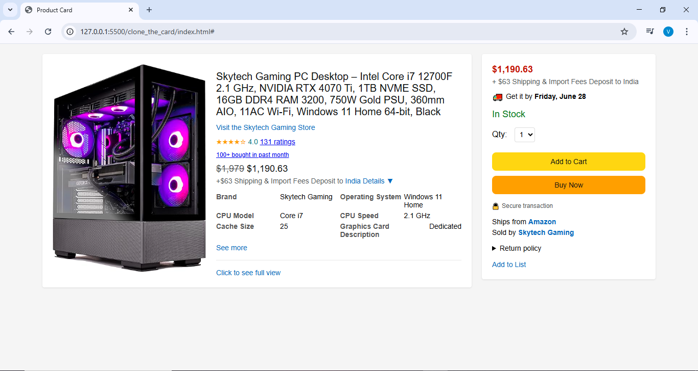

# 🛒 Clone-the-Card

A responsive HTML and CSS project that replicates the layout of an Amazon product detail page. This includes:
- Product image and thumbnails
- Product title, rating, and specifications
- Purchase section with pricing and action buttons

## 📸 Preview



> 
---

## 📂 Folder Structure

```
Clone-The-Card/
├── static/        # static files
├── index.html        # Main HTML file
├── stylescss         # CSS styling
├── Screenshots/clone_the_card.png       # (Optional) Layout preview image
└── README.md         # Project documentation
```

---

## 📦 How to Use

### 1. Clone the Repository

```
git clone https://github.com/your-username/Clone-The-Card.git
cd Clone-The-Card
```

### 2. Open in Browser

You can directly open `index.html` in any browser:

```bash
open index.html   # macOS
start index.html  # Windows
```

---

## 🛠️ Technologies Used

- HTML5
- CSS3 (Flexbox, Responsive Design)
- Media Queries

---

## ✨ Acknowledgments

- Inspired by the Amazon product detail UI
- Product images from Skytech on Amazon

---
